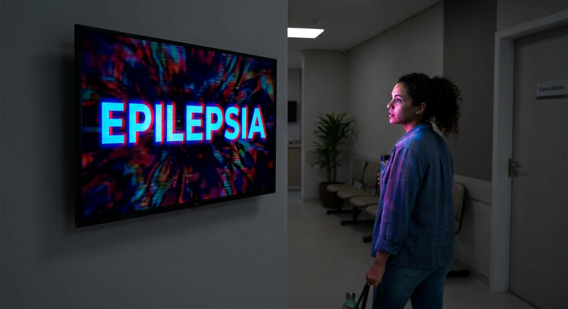

# Aula 4 03/09/26 - Conversão dos níveis de intensidade das imagens

Bem-vindo ao meu quarto blog da disciplina. Nessa aula, o tema principal discutido foi como transformar imagens considerando uma entrada com a range de sua intensidade para outra range. Nesse contexto, abordamos funções de I/O na escala de cinza com range 0-1. 

Portanto, acho esse foi um conteúdo que, apesar de simples, foi muito útil para meu aprendizado, pois vi que funções de normalização são muito aplicáveis, vi por exemplo que é utilizado em diagnósticos de doenças como o câncer.

# Tema deste blog

Dessa forma, um tema que, possui alinhamento com conversão de imagens que eu gostaria de tratar neste blog é sobre é o das variações rápidas e repetitivas de luminosidade em vídeos. Enquanto em uma imagem estática podemos analisar a intensidade luminosa de cada pixel em um determinado instante, em um vídeo também podemos observar como essas intensidades se modificam ao longo do tempo.
Esse fenômeno possui uma importância fundamental quando analisamos vídeos além da sua qualidade visual, pois determinadas frequências e padrões de variação luminosa podem provocar desconforto, dores de cabeça ou, em pessoas suscetíveis, desencadear crises de epilepsia fotossensível.
Não vou me aprofundar muito nesse tema mas vi que altas taxas de variância na luminância, bem como flashs e flicks podem ser detectados seguindo fórmulas e outros fatores. Segue alguns desses fatores (os tópicos foram pesquisados):

- A luminância relativa de uma imagem RGB pode ser calculada pela fórmula **L= 0.2126R+0.7152G+0.0722B**. Assim, L varia de 0 a 1.
- Pode-se calcular a variação de luminância relativa entre **dois frames consecutivos pela sua diferença modular**.
- Ocorre flash quando a variação de luminância relativa é **maior ou igual a 0.1**.
- A frequência máxima aceitável é de **3 Hz** para flashes, ou seja, apenas 3 flases por segundo, no máximo.
- Uma outra fórmula pesquisada é sobre o contraste de Michelson, uma medida útil para determinar padrões alternando entre claro e escuro: **Cm = (Lmax - Lmin)/(Lmax + Lmin)**.
- "Um consenso de especialistas sobre epilepsia fotossensível encontrou risco potencial associado a flashes com frequência ≥ 3 Hz, luminância ≥ 20 cd/m² e área suficientemente grande do campo visual". 

